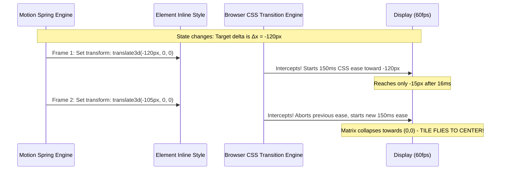

# Architectural Decision Records (ADR) — Layout Domain

This document records the architectural decisions, motion physics invariants, and bug post-mortems for the layout components (`ShuffleGrid`, `ShuffleList`, and `CompareImage`) in `src/components/layout/`.

---

## Index

- [[[ADR-LAYOUT-01]] Shared Layout Engine vs. CSS Transition Engine Collision (The Tile Glitch Post-Mortem)](#adr-layout-01-shared-layout-engine-vs-css-transition-engine-collision-the-tile-glitch-post-mortem)
- [[[ADR-LAYOUT-02]] Async Fisher-Yates Reordering with Framer Motion FLIP Spring Projection](#adr-layout-02-async-fisher-yates-reordering-with-framer-motion-flip-spring-projection)
- [[[ADR-LAYOUT-03]] Apple Dark Mode System Palette Calibration for 2D Grid Visual Tracking](#adr-layout-03-apple-dark-mode-system-palette-calibration-for-2d-grid-visual-tracking)
- [[[ADR-LAYOUT-04]] FLIP Shared Layout vs. Immediate CSS Transforms in Viewport Expansion (`CompareImage`)](#adr-layout-04-flip-shared-layout-vs-immediate-css-transforms-in-viewport-expansion-compareimage)

---

### [[ADR-LAYOUT-01]] Shared Layout Engine vs. CSS Transition Engine Collision (The Tile Glitch Post-Mortem)

- **Status**: Implemented & Invariant Established
- **Trigger**: `RUNTIME_BUG` (Tiles flying toward center and snapping back erratically during shuffle instead of gliding smoothly)
- **Origin**: `USER_OVERRULED_AI` / Post-Mortem

#### Context / Problem
During visual polish of the 24 tiles in `ShuffleGrid.tsx`, a Tailwind class `transition-transform` (or `transition: transform`) was added alongside `hover:scale-[1.03]` on `<motion.div layout>`. Immediately upon clicking the shuffle button, the entire grid animation broke: instead of each tile gliding to its new grid position via spring physics, tiles flew inward toward the center, shuddered, and glitched back.

#### Detailed Explanation: Why Did This Happen? (Student Deep Dive)

To understand this bug, we must look at how the browser and Framer Motion handle animation under the hood.

##### 1. How Motion's `layout` Prop Actually Works (The FLIP Technique)
Browsers do not have a native CSS property for "smoothly animate when a CSS Grid or Flexbox item changes position." When React/Preact updates the DOM array order, the browser instantly places the DOM elements at their new grid coordinates.

Framer Motion solves this using **FLIP** (First, Last, Invert, Play):

1. **F (First)**: Before the DOM updates, Motion reads the initial bounding rect of every tile:
   $$\text{Tile A: } (x=0, y=0)$$
2. **L (Last)**: The state changes (`setColors(newOrder)`), React re-renders, and the browser recalculates layout. Motion immediately reads the new bounding rect:
   $$\text{Tile A: } (x=120, y=80)$$
3. **I (Invert)**: Tile A is now physically at $(120, 80)$, but Motion wants it to look like it is still at $(0, 0)$. Motion computes the delta:
   $$\Delta x = 0 - 120 = -120\text{px}, \quad \Delta y = 0 - 80 = -80\text{px}$$
   Motion immediately injects an inline style onto Tile A:
   ```html
   <div style="transform: translate3d(-120px, -80px, 0px);">
   ```
   Now the user visually sees Tile A back at its starting position.
4. **P (Play)**: Motion runs a spring simulation. On **every animation frame** (every 16.6ms at 60Hz), Motion calculates the spring's current physical position and updates the inline `transform`:
   - Frame 1: `transform: translate3d(-120px, -80px, 0)`
   - Frame 2: `transform: translate3d(-102px, -68px, 0)`
   - Frame 3: `transform: translate3d(-85px, -55px, 0)`
   - ...
   - Frame 20: `transform: translate3d(0px, 0px, 0)` (settled at target).

##### 2. What Happens When You Add a CSS `transition: transform`?
If you put CSS `transition: transform 150ms ease` (or Tailwind `transition-transform`) on the same element:

- On Frame 1, Motion sets `transform: translate3d(-120px, -80px, 0)`.
- The browser CSS engine sees that `transform` has changed. Instead of immediately jumping to that value, the CSS engine says: *"Hold on! I have a CSS transition rule. I must smoothly ease to this value over 150ms."*
- **16 milliseconds later (Frame 2)**, before the CSS engine can even finish 10% of that 150ms transition, Motion writes the next value: `transform: translate3d(-102px, -68px, 0)`.
- The CSS engine aborts the first transition and starts a *new* 150ms transition toward the new value.
- Because Motion updates `transform` on **every single frame**, the browser's CSS transition engine is constantly restarted mid-flight.
- Worse, the CSS engine interpolates relative to the element's base position `(0, 0)` in layout space. This competing interpolation constantly pulls the matrix toward `(0, 0)` (the center/origin of the element's layout box), violently dragging the tile toward the center of the grid and snapping back!



#### Decision / Solution
1. **Completely eliminate all CSS transition classes** (`transition`, `transition-all`, `transition-transform`) from any element managed by Motion's `layout` engine.
2. If micro-interactions (like hover scale or tap press) are needed on a `layout` element, they **must** be implemented via Motion's native props (`whileHover={{ scale: 1.03 }}`, `whileTap={{ scale: 0.97 }}`). This guarantees that both the layout FLIP delta and the gesture scale are computed by the **same** internal matrix pipeline without browser engine collisions.

#### Code Snippet
```tsx
// ❌ BROKEN: CSS transition-transform fights Motion layout engine
<motion.div
  layout
  className="w-24 h-24 rounded-xl transition-transform hover:scale-105"
  style={{ backgroundColor: color }}
/>

// ✅ CORRECT: Clean motion.div layout with no CSS transition interference
<motion.div
  layout
  key={color}
  transition={{ type: 'spring', stiffness: 80, damping: 20 }}
  className="w-24 h-24 rounded-xl shadow-md cursor-pointer"
  style={{ backgroundColor: color }}
/>
```

#### Invariants & Rules
- **Invariant**: No `transition-*` CSS property may ever be attached to an element with the `layout` or `layoutId` prop in this codebase.
- **Rule**: If gesture scaling is required on layout items, use `whileHover` / `whileTap` so Motion's internal physics compositor manages both transformations simultaneously.

---

### [[ADR-LAYOUT-02]] Async Fisher-Yates Reordering with Framer Motion FLIP Spring Projection

- **Status**: Implemented
- **Trigger**: `PRODUCT_SPEC` / `CODE_REVIEW`
- **Origin**: `USER_DIRECTIVE`

#### Context / Problem
In `ShuffleGrid.tsx`, shuffling the 24 tiles all at once makes it difficult for a user to follow how elements swap. A staggered, iterative swap animation allows the eye to track individual tiles transitioning between positions across the 6x4 grid.

#### Decision / Solution
Implemented an asynchronous modified Fisher-Yates shuffle that swaps pairs in steps with a discrete `sleep(800)` interval:
- An `isShufflingRef` gate prevents concurrent execution if the user rapidly spams the shuffle button.
- React state (`setColors([...newOrder])`) triggers on each step, allowing Motion's `layout` spring (`stiffness: 80, damping: 20`) to animate the physical swap in real time.
- The trigger button displays a continuous spinning feedback state (`animate-spin` on `RotateCcw`) while the async loop is active.

#### Shallow Code Snippet
```tsx
const shuffleBoxes = async () => {
  if (isShufflingRef.current) return;
  isShufflingRef.current = true;
  setIsShuffling(true);

  const newOrder = [...colors];
  for (let i = newOrder.length - 1; i > 0; i = i - 2) {
    const j = Math.floor(Math.random() * (i + 1));
    [newOrder[i], newOrder[j]] = [newOrder[j], newOrder[i]];
    setColors([...newOrder]);
    await sleep(800);
  }

  isShufflingRef.current = false;
  setIsShuffling(false);
};
```

---

### [[ADR-LAYOUT-03]] Apple Dark Mode System Palette Calibration for 2D Grid Visual Tracking

- **Status**: Implemented
- **Trigger**: `CODE_REVIEW`
- **Origin**: `USER_DIRECTIVE`

#### Context / Problem
The original exercise utilized 1990s raw HTML 4.01 color strings (`#f00`, `#0f0`, `#000`, `#fff`, `#0ff`, `#f0a`). On the Studio Dark stage background (`#0d0d0f`):
- `#000` (pure black) completely disappeared into the canvas background, making tiles vanish during the shuffle.
- `#fff` and saturated `#f00` created extreme glare that overpowered adjacent tiles.

#### Decision / Solution
Replaced the array with 24 calibrated Apple Human Interface Guidelines (HIG) Dark Mode system colors (System Blue, Indigo, Purple, Pink, Red, Orange, Yellow, Green, Mint, Teal, Cyan, Titanium Gray). Every color:
- Maintains a controlled luminance range between 35% and 75% on dark surfaces.
- Preserves unique identity so that any tile can be visually tracked across its full shuffle trajectory.
- Integrates seamlessly with the dark mode stage aesthetics without visual dropouts or glare.

---

### [[ADR-LAYOUT-04]] FLIP Shared Layout vs. Immediate CSS Transforms in Viewport Expansion (`CompareImage`)

- **Status**: Implemented
- **Trigger**: `TECH_DEBT` / `CODE_REVIEW`
- **Origin**: `AI_AUTONOMOUS`

#### Context / Problem
In `CompareImage.tsx`, the exercise illustrates the difference between an image expanding with `layout` enabled versus without `layout`. Previously, raw `border-4` outlines and unstyled headings caused layout jumps when expanded.

#### Decision / Solution
- Applied Apple-style framed card surfaces (`rounded-xl`, `border border-neutral-700/80`, `bg-neutral-900/90`).
- Demonstrated that when `layout={true}`, Motion measures the thumbnail's bounding rect and interpolates smoothly to full viewport dimensions (`fixed top-0 left-0 w-dvw h-dvh object-contain z-50 bg-black/90`), while `layout={false}` causes a jarring, immediate jump without transitional frames.
